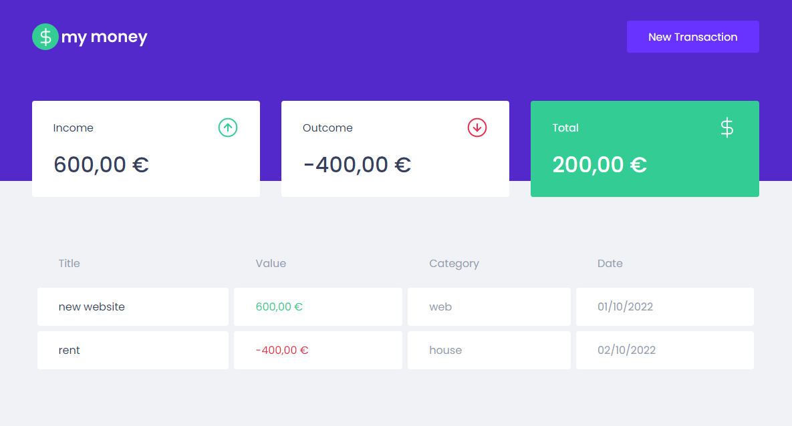
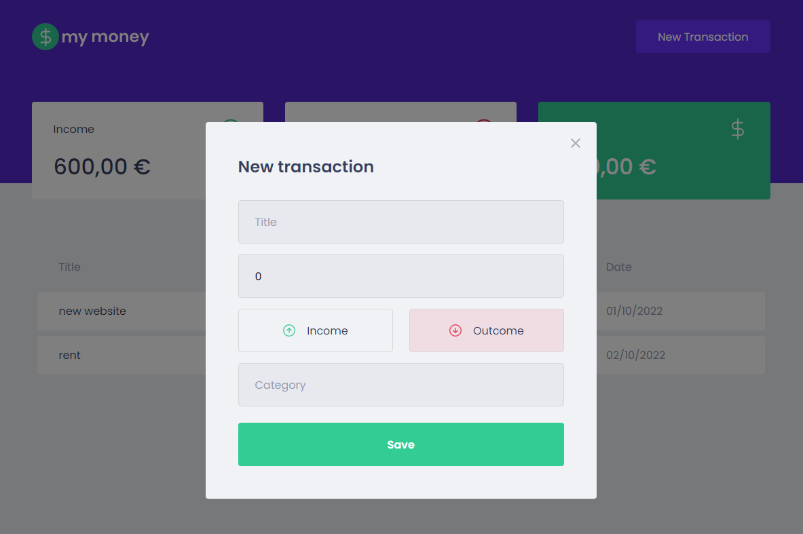

# My Money

## Tech used:

- **Lib**: [React](https://reactjs.org/) & [Typescript](https://www.typescriptlang.org/)
- **Styling** - [Styled Components](https://styled-components.com/)
- **HTTP client**: [Axios](https://axios-http.com/)
- **API moching**: [MirageJS](https://miragejs.com/)
- **Deployment**: [Vercel](https://vercel.com)

## Screenshots


 

## Overview

This project is the chapter 2 of the module ReactJS from [Rocketseat](https://www.rocketseat.com.br/).
Is a simple personal finance program to register cash income and outcome using frontend fundaments.

## Running Locally


```bash
$ git clone https://github.com/msdevpt/ignite-my-money
$ cd my-money
$ yarn
$ yarn start
```

## Credits

- [Rocketseat](https://www.rocketseat.com.br/) 
- [Design](https://www.figma.com/file/0xmu9mj2TJYoIOubBFWsk5/dtmoney-Ignite-(Copy)?node-id=0%3A1)
